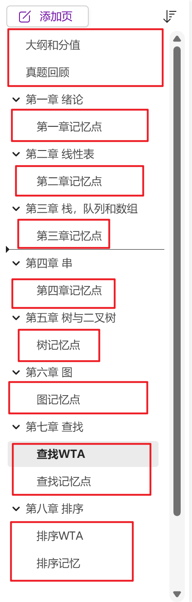
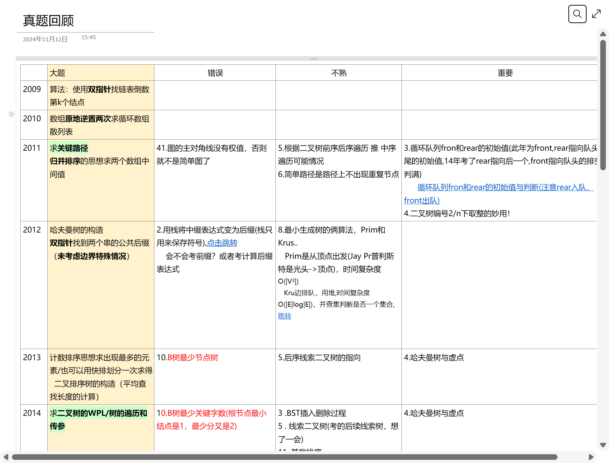
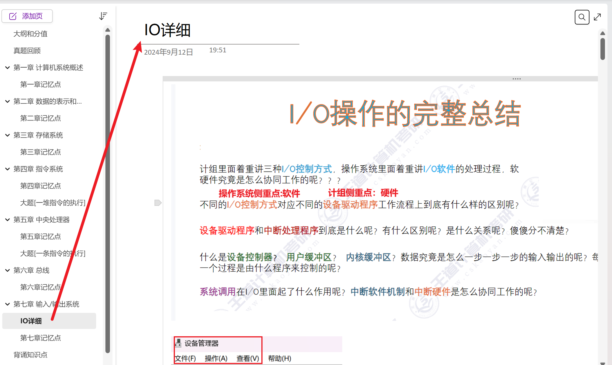
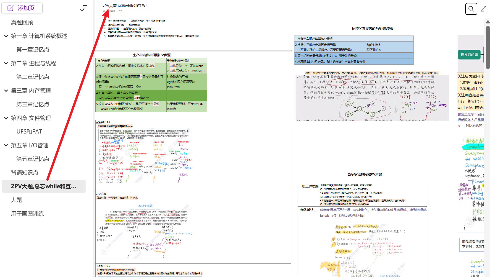

## 注意
**本源仓库**：https://github.com/ddy-ddy/cs-408
修改后的项目添加了文件夹“更新后的 onenote"，存放更新后的 onenote 408 笔记

## 更新介绍
- 该笔记更新于 25 考研期间（之所以 2026 年再发是因为懒惰和遗忘 QAQ）
- 由于 408 大纲和考试细节每年都有微小改动，所以下载后请辩证地看待笔记内容，知识的正确性请参考原教材
- 本人尽力保证笔记的正确性，如出现小纰漏请 issues，请谅解

## 更新概括
1. 以数据结构举例
红框圈住的是新增内容，没有圈住的是原作者创建的页面（大部分也有改动）
- 大纲分值：图片截取 25 王道咸鱼强化班内容，梳理题型分布和分值
- xx 记忆点：为作者当时考研基于自己遗忘点整理，可自行修改
- 新增应用题 算法题，主要是 25 强化班咸鱼的 PPT（图片没截取到）
- 真题回顾：统计作者历年大题写题情况

2. 以计组为例
- 新增 IO 完整操作，这里我记得写得比较乱，因为王道书中这个知识点模棱两可，作者只能从强化课，网络等众多地方提取内容

3. 以操作系统为例
- 新增 PV 总结

-----